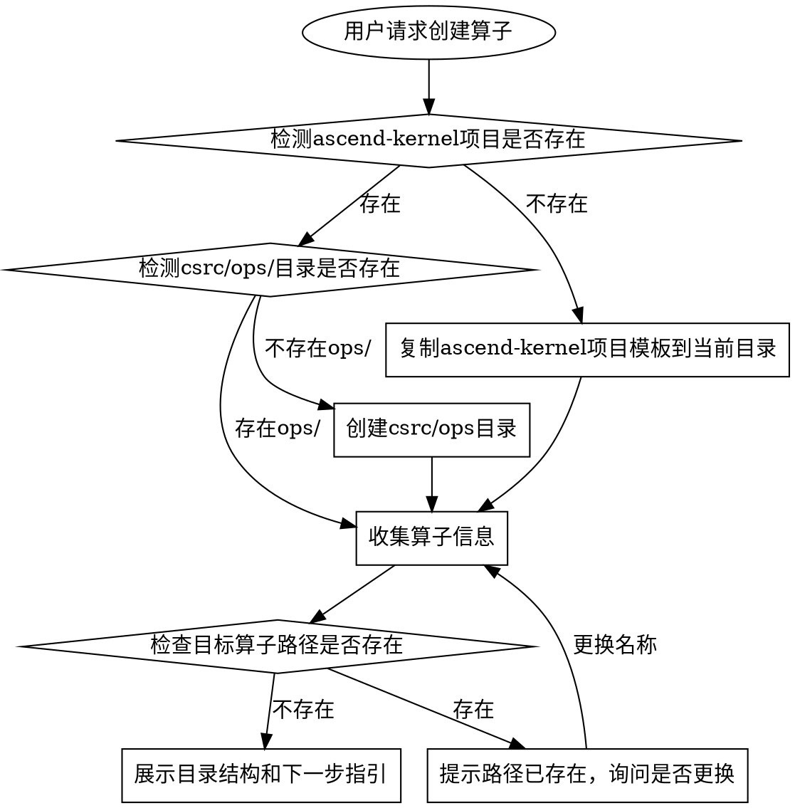

# AscendC 算子工程初始化

**Skill类型**：流程导向型（多阶段工作流，阶段检查点）

快速创建 Ascend-Kernel 算子工程，所有算子统一生成在 `csrc/ops` 目录下，并保证后续可直接进入设计/编码/编译测试阶段。

## 核心原则

1. **单一目录**：所有算子统一生成在 `csrc/ops` 目录下
2. **安全优先**：自动检查目录是否存在，避免覆盖现有文件
3. **命名规范**：严格要求snake_case命名格式
4. **项目检测**：优先使用现有ascend-kernel项目，不存在则复制模板
5. **结果可验证**：输出目录结构、注册变更点、构建测试命令
6. **防坑内建**：显式提示 CMake 三处更新、`EXEC_KERNEL_CMD` 左值要求、环境依赖

## 工作流程



## 反模式清单（NEVER DO THESE）

- ❌ 不要在非csrc/ops目录下生成算子
- ❌ 不要覆盖已存在的算子目录
- ❌ 不要使用除snake_case外的其他命名格式
- ❌ 不要跳过目录存在性检查
- ❌ 不要只创建算子目录而不创建 `op_host/` 和 `op_kernel/`
- ❌ 不要忘记更新 `ops.h`、`register.cpp`、`csrc/CMakeLists.txt`（三处）
- ❌ 不要在 `EXEC_KERNEL_CMD` 中直接传右值临时变量
- ❌ 不要使用 ACLNN 作为新算子实现路径

## 步骤1：检测并初始化Ascend-Kernel项目

### 1.1 检测Ascend-Kernel项目位置

**检测策略**：
1. 检查当前目录是否为ascend-kernel项目（包含build.sh、CMakeLists.txt、csrc/）
2. 检查当前目录下的ascend-kernel子目录
3. 检查一级子目录中的ascend-kernel项目

**执行命令**：
```bash
bash <skill_dir>/scripts/detect_ascend_kernel_project.sh
```

### 1.2 处理检测结果

| 检测结果 | 处理方式 |
|----------|----------|
| `PROJECT_FOUND:<path>` | 使用现有项目，继续步骤2 |
| `PROJECT_FOUND_NO_OPS:<path>` | 在项目中创建csrc/ops/目录，继续步骤2 |
| `PROJECT_NOT_FOUND` | 复制ascend-kernel模板到当前目录，继续步骤2 |
| `MULTIPLE_PROJECTS:<path1> <path2> ...` | 列出所有项目，让用户选择 |

### 1.3 复制项目模板（如果需要）

**执行命令**：
```bash
cp -r "<skill_dir>/templates/ascend-kernel" ./ascend-kernel
chmod +x ./ascend-kernel/build.sh
```

**重要**：复制后必须 `chmod +x build.sh`，否则编译时会报 `Permission denied`。

**验证**：确认ascend-kernel目录包含：
- build.sh（且有执行权限）
- CMakeLists.txt
- csrc/ 目录

## 步骤2：收集算子信息（最小必填）

**必须确认的信息**：

| 信息 | 格式要求 | 说明 |
|------|----------|------|
| 算子名称 | snake_case | 如 `rms_norm`, `flash_attn` |

**确认信息**：
```
=== Ascend-Kernel算子信息 ===
算子名称: <op_name>
生成路径: <ascend_kernel_path>/csrc/ops/<op_name>

确认创建？[Y/n]
```

## 步骤3：检查前置条件

1. 确认在ascend-kernel项目根目录下（build.sh存在且有执行权限）
2. 确认csrc/ops/目录存在（不存在则创建 `mkdir -p csrc/ops`）
3. 确认目标目录 `csrc/ops/<op_name>` 不存在

## 步骤4：创建算子骨架

**创建目录**：
```bash
mkdir -p csrc/ops/<op_name>/op_host csrc/ops/<op_name>/op_kernel
```

在 `csrc/ops/<op_name>/` 下创建以下文件：

```
csrc/ops/<op_name>/
├── CMakeLists.txt
├── design.md                  # 设计文档占位（由 design skill 填充）
├── op_host/
│   └── <op_name>.cpp          # Host 占位（由 code-gen skill 替换）
└── op_kernel/
    └── <op_name>.cpp          # Kernel 占位（由 code-gen skill 替换）
```

### 4.1 文件内容最小模板

1. `CMakeLists.txt`
```cmake
ascendc_add_operator(OP_NAME <op_name>)
```

2. `op_host/<op_name>.cpp`
- 包含 BSD 3-Clause 头
- include `torch_kernel_helper.h`
- include `aclrtlaunch_<op_name>.h`
- 提供 `namespace ascend_kernel { at::Tensor <op_name>(...) { ... } }` 占位

3. `op_kernel/<op_name>.cpp`
- 包含 BSD 3-Clause 头
- include `kernel_operator.h`
- 提供 `extern "C" __global__ __aicore__ void <op_name>(...)` 占位

## 步骤5：注册提醒（必须执行但不在本 skill 自动改代码）

初始化完成后，明确提示用户/后续 skill 更新以下三处：

1. `csrc/ops.h`：添加函数声明
2. `csrc/register.cpp`：添加 `m.def` 与 `m.impl`
3. `csrc/CMakeLists.txt`：
   - `OP_SRCS` 添加 host 文件
   - `ascendc_library(...)` 添加 kernel 文件
   - 若模板中存在同名 ACLNN 封装，必须移除对应 `aclnn/<op>.cpp`

> 说明：这是实战最高频遗漏点，必须在初始化阶段提前提示。

## 步骤6：展示项目结构与下一步

**提示用户**：
```
Ascend-Kernel项目初始化成功！

项目结构:
<ascend_kernel_path>/
├── build.sh                    # 构建脚本
├── CMakeLists.txt              # CMake配置
├── csrc/
│   ├── ops/                    # 算子目录
│   ├── aclnn/                  # ACLNN算子封装
│   ├── utils/                  # 工具类
│   ├── ops.h                   # 算子声明
│   └── register.cpp            # 算子注册
├── python/                     # Python包
└── tests/                      # 测试用例

下一步操作：
 调用 ascendc-operator-design skill 完成设计文档
```

## 注意事项

- 算子名称只能包含字母、数字和下划线
- 系统会自动检查目录是否存在，避免覆盖
- 如果当前目录没有ascend-kernel项目，系统会自动复制模板
- 新算子必须使用 AscendC 路径，禁止 ACLNN 实现路径
- `EXEC_KERNEL_CMD` 参数必须是左值；如 `double` 先转 `float` 局部变量再传
- 测试基线建议以 PyTorch 参考实现为准，CPU 不支持的 dtype（如部分 fp16 pooling）需转 float32 对比

## 交付标准（DoD）

完成本 skill 后，至少应满足：

- [ ] 已定位或创建 `ascend-kernel` 项目
- [ ] 已创建 `csrc/ops/<op_name>/` 标准骨架
- [ ] 已明确三处注册更新点（`ops.h` / `register.cpp` / `csrc/CMakeLists.txt`）
- [ ] 已给出可执行的构建、安装、测试命令
- [ ] 已提示关键防坑项（环境、左值参数、CMake 三处更新）
